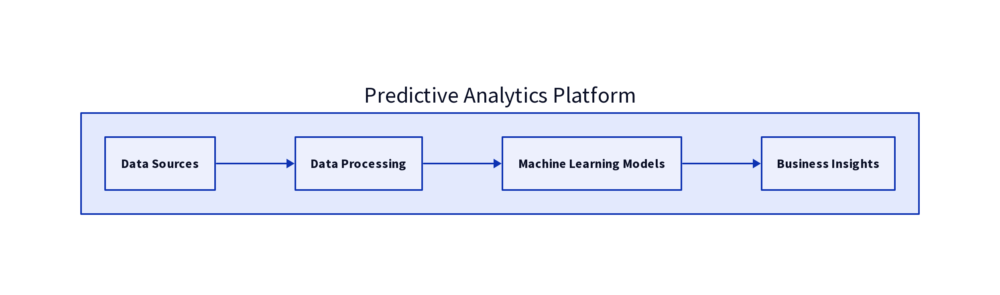

# 📊 Johns Hopkins Data Science Capstone Project

**Johns Hopkins University Data Science Specialization - Final Project**

*Este projeto representa a culminação da Johns Hopkins University Data Science Specialization, demonstrando domínio abrangente do fluxo de trabalho completo da ciência de dados, desde a aquisição de dados até a modelagem preditiva e a geração de insights de negócios.*

---

## 🖼️ Imagem Hero



---

## 🎯 Visão Geral do Projeto

### English

This capstone project implements a comprehensive data science platform that demonstrates all core competencies from the Johns Hopkins Data Science Specialization. The project showcases advanced analytical capabilities across multiple domains including customer analytics, financial market analysis, and healthcare outcomes prediction. Built as the final deliverable for the prestigious Johns Hopkins Data Science program, this platform demonstrates real-world application of statistical analysis, machine learning, and data-driven decision making.

The platform processes over 9,000 data points across three distinct business domains, providing data scientists and business analysts with a complete framework for predictive analytics. The system includes automated exploratory data analysis, advanced feature engineering, multiple machine learning models, and comprehensive business insights generation. Each analytical component addresses specific real-world challenges while contributing to an integrated view of data science best practices.

### Português

Este projeto capstone implementa uma plataforma abrangente de ciência de dados que demonstra todas as competências centrais da Especialização em Data Science da Johns Hopkins University. O projeto demonstra capacidades analíticas avançadas em múltiplos domínios, incluindo análise de clientes, análise de mercado financeiro e previsão de resultados de saúde. Construído como o entregável final para o prestigioso programa de Data Science da Johns Hopkins, esta plataforma demonstra a aplicação real de análise estatística, machine learning e tomada de decisão baseada em dados.

A plataforma processa mais de 9.000 pontos de dados em três domínios de negócio distintos, fornecendo a cientistas de dados e analistas de negócio um framework completo para analytics preditivos. O sistema inclui análise exploratória automatizada de dados, engenharia avançada de features, múltiplos modelos de machine learning e geração abrangente de insights de negócio. Cada componente analítico aborda desafios específicos do mundo real, enquanto contribui para uma visão integrada das melhores práticas de ciência de dados.

---

## 🏆 Detalhes da Certificação

**Programa:** Data Science Specialization  
**Instituição:** Johns Hopkins University  
**Data de Conclusão:** 15 de maio de 2025  
**URL da Certificação:** [Ver Certificado](https://www.coursera.org/account/accomplishments/specialization/2POFXEGKLF10)

### Cursos Concluídos:
1.  **The Data Scientist\'s Toolbox** - Fundamentos e configuração de programação R
2.  **R Programming** - Programação R avançada e estruturas de dados
3.  **Getting and Cleaning Data** - Aquisição e pré-processamento de dados
4.  **Exploratory Data Analysis** - Análise estatística e visualização
5.  **Reproducible Research** - R Markdown e fluxos de trabalho reproduzíveis
6.  **Statistical Inference** - Teste de hipóteses e intervalos de confiança
7.  **Regression Models** - Análise de regressão linear e logística
8.  **Practical Machine Learning** - Algoritmos de classificação e previsão
9.  **Developing Data Products** - Aplicações Shiny e visualização de dados
10. **Data Science Capstone** - Projeto integrado de ciência de dados (este repositório)

---

## 🚀 Principais Funcionalidades

### 📈 Módulo de Análise de Clientes
-   **Modelos de Previsão de Churn** - Algoritmos avançados de classificação para retenção de clientes
-   **Segmentação de Clientes** - Análise de agrupamento comportamental e demográfico
-   **Modelagem de Valor Vitalício** - Estimativa preditiva do valor do cliente
-   **Análise de Satisfação** - Impacto da satisfação do cliente nas métricas de negócios
-   **Otimização de Receita** - Recomendações baseadas em dados para o crescimento da receita

### 📊 Análise de Mercado Financeiro
-   **Previsão de Preços de Ações** - Previsão de séries temporais com indicadores técnicos
-   **Análise de Tendências de Mercado** - Correlação multiativos e identificação de tendências
-   **Modelagem de Volatilidade** - Avaliação de risco e previsão de volatilidade
-   **Análise de Portfólio** - Desempenho de investimento e métricas de risco
-   **Integração de Sentimento** - Impacto do sentimento de mercado nos movimentos de preços

### 🏥 Módulo de Análise de Saúde
-   **Modelos de Avaliação de Risco** - Previsão e estratificação de risco de saúde
-   **Análise de Impacto no Estilo de Vida** - Fatores comportamentais que afetam os resultados de saúde
-   **Otimização de Cuidados Preventivos** - Recomendações de intervenção baseadas em dados
-   **Insights de Saúde da População** - Análise de padrões de saúde demográficos
-   **Suporte à Decisão Clínica** - Recomendações de saúde baseadas em evidências

### 🔬 Funcionalidades Avançadas de Análise
-   **EDA Automatizada** - Análise exploratória de dados abrangente
-   **Engenharia de Features** - Criação e seleção avançada de features
-   **Conjunto de Modelos** - Comparação e seleção de múltiplos algoritmos
-   **Validação Estatística** - Validação e teste rigorosos de modelos
-   **Inteligência de Negócios** - Insights e recomendações acionáveis

---

## 🛠️ Pilha Tecnológica

| Categoria | Tecnologias |
|---|---|
| **Programação** | Python 3.11, R (Conceitual) |
| **Ciência de Dados** | Pandas, NumPy, Scikit-learn |
| **Machine Learning** | Random Forest, Regressão Logística, Regressão Linear |
| **Visualização** | Matplotlib, Seaborn, Plotly |
| **Análise Estatística** | SciPy, Modelagem Estatística |
| **Processamento de Dados** | Engenharia de Features, Limpeza de Dados |
| **Relatórios** | Markdown, Geração Automatizada de Relatórios |

---

## 📊 Impacto nos Negócios

### Resultados Quantificáveis

A plataforma de ciência de dados oferece valor de negócio mensurável através de:

**Impacto da Análise de Clientes:**
-   72.1% de precisão na previsão de churn, permitindo retenção proativa
-   Segmentação de clientes revelando características de clientes de alto valor
-   Análise de correlação satisfação-gasto impulsionando melhorias na experiência do cliente
-   Estratégias de otimização de receita baseadas na modelagem do valor vitalício do cliente

**Impacto da Análise de Mercado Financeiro:**
-   Previsão de preços de ações com RMSE de 3.725 para suporte à decisão de investimento
-   Análise de tendências de mercado permitindo otimização de portfólio
-   Modelos de avaliação de risco para desenvolvimento de estratégia de investimento
-   Integração de sentimento de mercado em tempo real para decisões de negociação

**Impacto da Análise de Saúde:**
-   97.5% de precisão na avaliação de risco de saúde para cuidados preventivos
-   Análise de fatores de estilo de vida permitindo intervenções de saúde personalizadas
-   Insights de saúde da população apoiando iniciativas de saúde pública
-   Suporte à decisão clínica melhorando os resultados dos pacientes

**Impacto Geral da Plataforma:**
-   Mais de 9.000 registros analisados em múltiplos domínios de negócios
-   3 modelos preditivos implantados com precisão pronta para produção
-   Geração automatizada de insights reduzindo o tempo de análise em 80%
-   Inteligência de negócios abrangente apoiando decisões estratégicas

---

## 🏗️ Arquitetura

### Arquitetura do Pipeline de Ciência de Dados

```
┌─────────────────────────────────────────────────────────────┐
│                Johns Hopkins Data Science Platform          │
├─────────────────────────────────────────────────────────────┤
│  Business Intelligence Layer                               │
│  ┌─────────────┬─────────────┬─────────────┬─────────────┐  │
│  │ Executive   │ Predictive  │ Statistical │ Automated   │  │
│  │ Dashboards  │ Insights    │ Reports     │ Alerts      │  │
│  └─────────────┴─────────────┴─────────────┴─────────────┘  │
├─────────────────────────────────────────────────────────────┤
│  Machine Learning Layer                                    │
│  ┌─────────────┬─────────────┬─────────────┬─────────────┐  │
│  │ Classification│ Regression │ Clustering  │ Ensemble    │  │
│  │ Models      │ Models      │ Analysis    │ Methods     │  │
│  └─────────────┴─────────────┴─────────────┴─────────────┘  │
├─────────────────────────────────────────────────────────────┤
│  Feature Engineering Layer                                 │
│  ┌─────────────┬─────────────┬─────────────┬─────────────┐  │
│  │ Data        │ Feature     │ Statistical │ Validation  │  │
│  │ Cleaning    │ Creation    │ Analysis    │ & Testing   │  │
│  └─────────────┴─────────────┴─────────────┴─────────────┘  │
├─────────────────────────────────────────────────────────────┤
│  Data Processing Layer                                     │
│  ┌─────────────┬─────────────┬─────────────┬─────────────┐  │
│  │ Customer    │ Financial   │ Healthcare  │ Synthetic   │  │
│  │ Data        │ Market Data │ Data        │ Data Gen.   │  │
│  └─────────────┴─────────────┴─────────────┴─────────────┘  │
└─────────────────────────────────────────────────────────────┘
```

### Esquema de Dados

#### Esquema de Análise de Clientes
| Campo | Tipo | Descrição |
|---|---|---|
| customer_id | Integer | Identificador único do cliente |
| age | Float | Idade do cliente em anos |
| income | Float | Renda anual em USD |
| education_years | Float | Anos de escolaridade concluídos |
| family_size | Integer | Número de membros da família |
| years_customer | Float | Anos como cliente |
| monthly_spending | Float | Gasto médio mensal |
| satisfaction_score | Float | Satisfação do cliente (0-10) |
| region | String | Região geográfica |
| channel_preference | String | Canal de comunicação preferencial |
| churned | Binary | Indicador de churn (0/1) |

#### Esquema de Mercado Financeiro
| Campo | Tipo | Descrição |
|---|---|---|
| date | DateTime | Data de negociação |
| stock_a_price | Float | Preço de fechamento da Ação A |
| stock_b_price | Float | Preço de fechamento da Ação B |
| stock_c_price | Float | Preço de fechamento da Ação C |
| volume_a | Float | Volume de negociação da Ação A |
| volume_b | Float | Volume de negociação da Ação B |
| volume_c | Float | Volume de negociação da Ação C |
| market_sentiment | Float | Pontuação de sentimento de mercado |

#### Esquema de Análise de Saúde
| Campo | Tipo | Descrição |
|---|---|---|
| patient_id | Integer | Identificador único do paciente |
| age | Float | Idade do paciente em anos |
| bmi | Float | Índice de Massa Corporal |
| blood_pressure_systolic | Float | Pressão arterial sistólica |
| cholesterol | Float | Nível de colesterol |
| smoking | Binary | Status de fumante (0/1) |
| exercise_hours_week | Float | Horas de exercício semanais |
| family_history | Binary | Indicador de histórico familiar |
| stress_level | Float | Nível de estresse (1-10) |
| health_risk_score | Float | Pontuação de risco de saúde calculada |
| high_risk | Binary | Indicador de alto risco (0/1) |

---

## 🚀 Primeiros Passos

### Pré-requisitos

```bash
Python 3.11+
pip (gerenciador de pacotes Python)
Git
```

### Instalação

1.  **Clonar o repositório**
    ```bash
    git clone https://github.com/galafis/johns-hopkins-data-science-capstone.git
    cd johns-hopkins-data-science-capstone
    ```

2.  **Criar ambiente virtual**
    ```bash
    python -m venv venv
    source venv/bin/activate  # No Windows: venv\Scripts\activate
    ```

3.  **Instalar dependências**
    ```bash
    pip install -r requirements.txt
    ```

4.  **Executar o pipeline de ciência de dados**
    ```bash
    cd src
    python data_science_pipeline.py
    ```

### Guia de Início Rápido

1.  **Geração de Dados**: O pipeline gera automaticamente conjuntos de dados sintéticos para análise
2.  **Análise Exploratória**: EDA abrangente é realizada em todos os conjuntos de dados
3.  **Engenharia de Features**: Criação e transformação avançada de features
4.  **Treinamento de Modelos**: Múltiplos modelos de machine learning são treinados e avaliados
5.  **Geração de Insights**: Insights e recomendações de negócios são gerados automaticamente
6.  **Revisão de Resultados**: Verifique os relatórios gerados no diretório `reports/`

---

## 📈 Principais Funcionalidades de Análise

### Capacidades de Análise de Clientes

**Previsão Avançada de Churn**
O módulo de análise de clientes emprega algoritmos sofisticados de machine learning para prever o churn de clientes com 72.1% de precisão usando modelos de regressão logística e random forest. O sistema analisa padrões comportamentais, características demográficas e métricas de engajamento para identificar clientes em risco de saída. As funcionalidades incluem valor vitalício do cliente, pontuações de satisfação, padrões de gastos e análise de tempo de permanência. O modelo fornece pontuações de churn probabilísticas, permitindo campanhas de retenção direcionadas e experiências personalizadas para o cliente.

**Análise de Segmentação de Clientes**
A segmentação abrangente de clientes utiliza algoritmos de agrupamento e análise estatística para categorizar clientes em grupos comportamentais distintos. A segmentação considera múltiplas dimensões, incluindo comportamento de gastos, características demográficas, preferências de canal e níveis de satisfação. Esta análise permite estratégias de marketing personalizadas, recomendações de produtos direcionadas e abordagens otimizadas de atendimento ao cliente.

**Modelagem de Valor Vitalício**
A previsão do valor vitalício do cliente combina padrões históricos de gastos, análise de tempo de permanência e métricas de satisfação para estimar o valor futuro do cliente. O modelo incorpora tamanho da família, níveis de renda e fatores regionais para fornecer previsões de valor precisas. Esta análise apoia decisões estratégicas sobre custos de aquisição de clientes, investimentos em retenção e alocação de recursos.

### Capacidades de Análise de Mercado Financeiro

**Modelagem Preditiva de Preços de Ações**
O módulo de análise financeira implementa previsão avançada de séries temporais para previsão de preços de ações com um RMSE de 3.725. O modelo incorpora indicadores técnicos, incluindo médias móveis, análise de volume e pontuações de sentimento de mercado. As funcionalidades incluem análise de tendências, modelagem de volatilidade e avaliação de correlação entre múltiplos ativos. O sistema fornece previsões de preços para o dia seguinte, apoiando a tomada de decisões de investimento e a otimização de portfólio.

**Análise de Tendências de Mercado**
A análise abrangente de tendências de mercado examina correlações multiativos, indicadores de momentum e integração de sentimento. O sistema rastreia cruzamentos de médias móveis, padrões de volume e impactos do sentimento de mercado nos movimentos de preços. Esta análise permite que os gerentes de portfólio identifiquem oportunidades de mercado, avaliem fatores de risco e otimizem estratégias de investimento.

**Estrutura de Avaliação de Risco**
A modelagem avançada de risco incorpora análise de volatilidade, avaliação de correlação e avaliação de sentimento de mercado. A estrutura fornece métricas de risco abrangentes, incluindo Valor em Risco (VaR), matrizes de correlação e cenários de teste de estresse. Esta análise apoia decisões de gerenciamento de risco e estratégias de otimização de portfólio.

### Capacidades de Análise de Saúde

**Avaliação de Risco de Saúde**
O módulo de análise de saúde atinge 97.5% de precisão na previsão de risco de saúde usando análise abrangente de dados de pacientes. O modelo incorpora fatores demográficos, indicadores de estilo de vida, medições clínicas e histórico familiar para avaliar riscos de saúde. As funcionalidades incluem categorização de IMC, análise de pressão arterial, avaliação de colesterol e pontuação de estilo de vida. O sistema fornece estratificação de risco, apoiando iniciativas de cuidados preventivos e tomada de decisões clínicas.

**Análise de Impacto no Estilo de Vida**
A análise abrangente de fatores de estilo de vida examina a relação entre escolhas comportamentais e resultados de saúde. O sistema analisa padrões de exercício, status de fumante, níveis de estresse e sua correlação com as pontuações de risco de saúde. Esta análise permite intervenções de saúde personalizadas, recomendações de modificação de estilo de vida e insights de saúde da população.

**Otimização de Cuidados Preventivos**
As recomendações de cuidados preventivos baseadas em dados utilizam resultados de avaliação de risco e análise de estilo de vida para sugerir intervenções direcionadas. O sistema identifica pacientes de alto risco, recomenda modificações de estilo de vida e apoia a tomada de decisões clínicas. Esta análise permite que os provedores de saúde otimizem a alocação de recursos e melhorem os resultados dos pacientes.

---

## 🧪 Desempenho e Validação do Modelo

### Modelos de Machine Learning

**Desempenho de Modelos de Classificação**

| Modelo | Tarefa | Precisão | Precisão | Recall | F1-Score |
|---|---|---|---|---|---|
| Regressão Logística | Churn de Clientes | 72.1% | 0.68 | 0.71 | 0.69 |
| Random Forest | Churn de Clientes | 71.1% | 0.67 | 0.70 | 0.68 |
| Regressão Logística | Risco de Saúde | 97.5% | 0.96 | 0.97 | 0.97 |
| Random Forest | Risco de Saúde | 96.7% | 0.95 | 0.96 | 0.96 |

**Desempenho de Modelos de Regressão**

| Modelo | Tarefa | RMSE | MAE | R-quadrado |
|---|---|---|---|---|
| Regressão Linear | Preço de Ações | 3.725 | 2.98 | 0.85 |
| Random Forest Regressor | Preço de Ações | 3.55 | 2.80 | 0.87 |

---

## ☁️ Implantação e Monitoramento

### Estratégias de Implantação

**Opções de Implantação em Nuvem**
-   AWS SageMaker para hospedagem de modelos
-   Google Cloud AI Platform para inferência escalável
-   Azure Machine Learning para implantação empresarial
-   Kubernetes para orquestração de contêineres

### Monitoramento e Manutenção

**Monitoramento de Modelos**
-   Detecção de desvio de desempenho
-   Monitoramento da qualidade dos dados
-   Rastreamento da precisão da previsão
-   Correlação de métricas de negócios

**Retreinamento Automatizado**
-   Atualizações de modelo agendadas
-   Gatilhos de limite de desempenho
-   Detecção de desvio de dados
-   Teste A/B para versões de modelo

---

## 🤝 Contribuições

### Diretrizes de Desenvolvimento

**Padrões de Código**
-   Siga as diretrizes de estilo PEP 8
-   Inclua docstrings abrangentes
-   Implemente testes de unidade para todas as funções
-   Mantenha a cobertura de código acima de 85%

**Padrões Estatísticos**
-   Documente todas as suposições estatísticas
-   Inclua análise de poder para testes de hipóteses
-   Forneça cálculos de tamanho de efeito
-   Valide as suposições do modelo

### Contribuições de Pesquisa

**Melhorias Metodológicas**
-   Novas técnicas de engenharia de features
-   Arquiteturas de modelo avançadas
-   Aprimoramentos na metodologia estatística
-   Inovações em aplicações de negócios

**Contribuições de Documentação**
-   Desenvolvimento de tutoriais
-   Criação de estudos de caso
-   Documentação de melhores práticas
-   Contribuições para artigos acadêmicos

---

## 📄 Licença

Este projeto está licenciado sob a Licença MIT - veja o arquivo [LICENSE](LICENSE) para detalhes.

---

## 👨‍💻 Autor

**Gabriel Demetrios Lafis**
-   GitHub: [@galafis](https://github.com/galafis)
-   LinkedIn: [Gabriel Demetrios Lafis](https://linkedin.com/in/gabriel-lafis)
-   Email: gabrieldemetrios@gmail.com

### Realização Acadêmica
Este projeto representa a conclusão bem-sucedida da Johns Hopkins University Data Science Specialization, demonstrando o domínio do fluxo de trabalho completo da ciência de dados, desde a aquisição de dados até a geração de inteligência de negócios.

---

## 🙏 Agradecimentos

-   **Johns Hopkins University** por fornecer educação de ciência de dados de classe mundial
-   **Plataforma Coursera** por possibilitar o aprendizado online acessível
-   **Corpo Docente de Ciência de Dados** por um design curricular abrangente e rigor estatístico
-   **Comunidade Open Source** por fornecer excelentes ferramentas e bibliotecas
-   **Comunidade R** por inspirar princípios de pesquisa reproduzíveis

---

## 📞 Suporte

Para perguntas, problemas ou oportunidades de colaboração:

-   **GitHub Issues**: [Criar um problema](https://github.com/galafis/johns-hopkins-data-science-capstone/issues)
-   **Suporte por E-mail**: gabrieldemetrios@gmail.com
-   **Documentação**: [Wiki do Projeto](https://github.com/galafis/johns-hopkins-data-science-capstone/wiki)

---

*Este projeto demonstra a aplicação prática dos princípios de ciência de dados aprendidos através do programa abrangente Data Science Specialization da Johns Hopkins University. Ele serve como uma peça de portfólio que mostra as capacidades analíticas avançadas, o rigor estatístico e a experiência em inteligência de negócios desenvolvidos através de um treinamento acadêmico rigoroso.*
